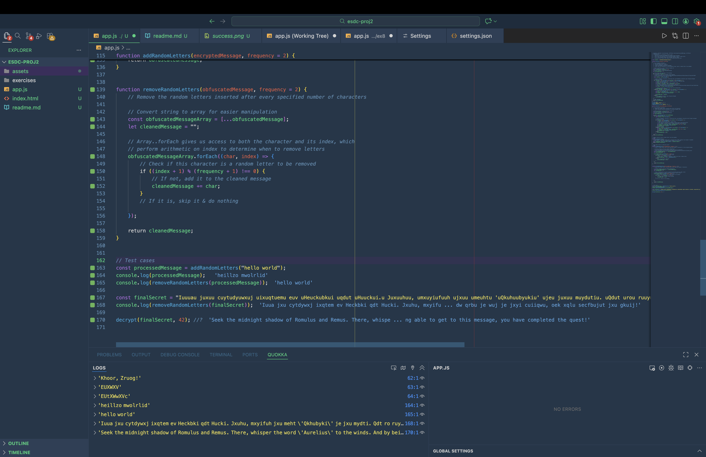
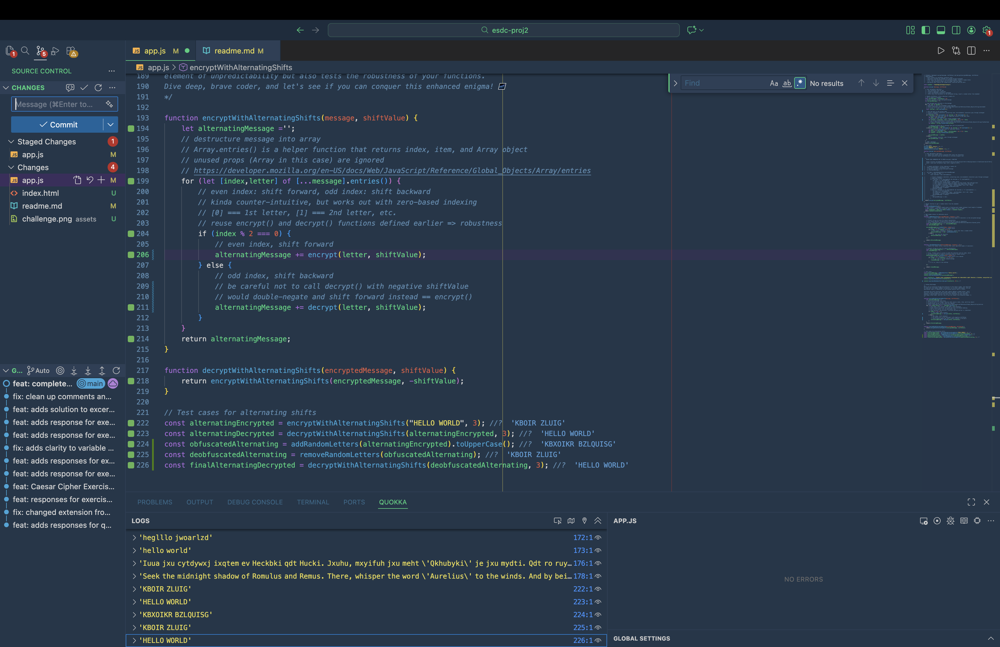

# Project 2: Caesar Cipher

## Main Assignment

- encrypt messages by shifting letters a specified amount
- preserve letter casing through transformation
- add random letters to obfuscate
- decrypt by reversing the algorithm

## Extra Challenge

- alternate shift direction (forwards, backwards) every letter
- proves robustness of `encrypt()` and `decrypt()` through reusability
